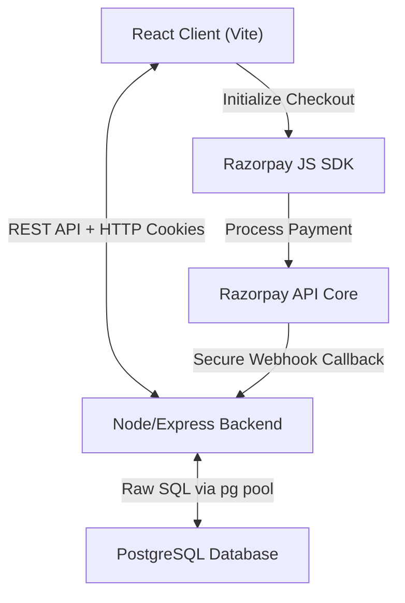
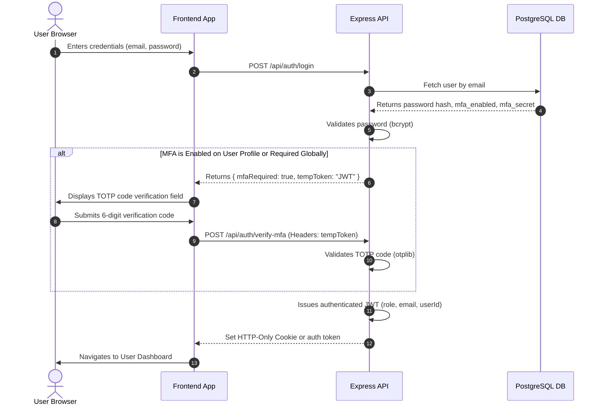
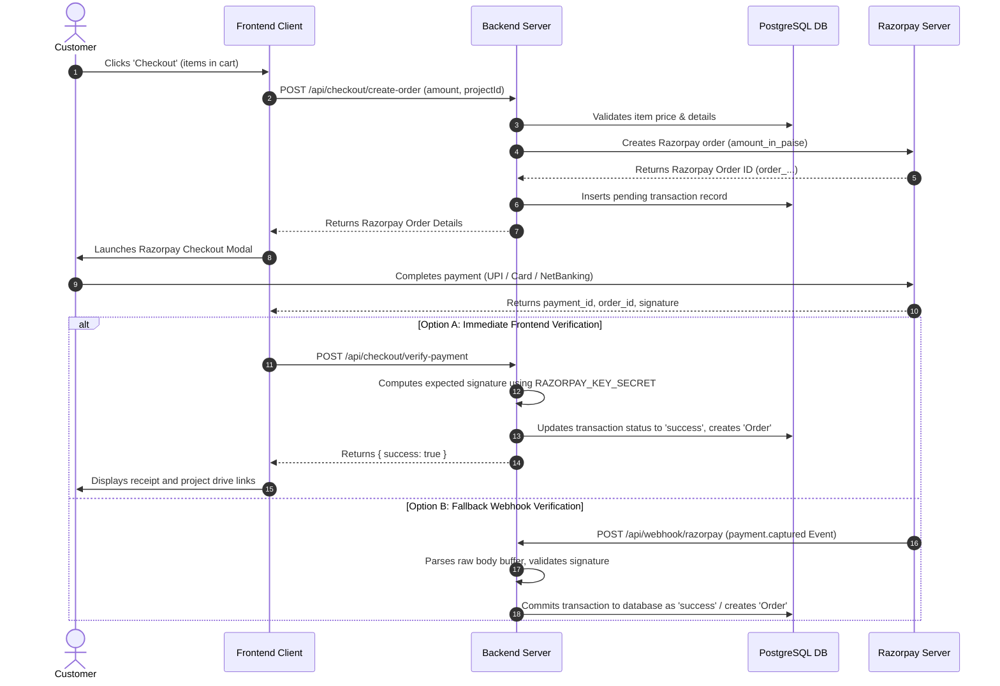
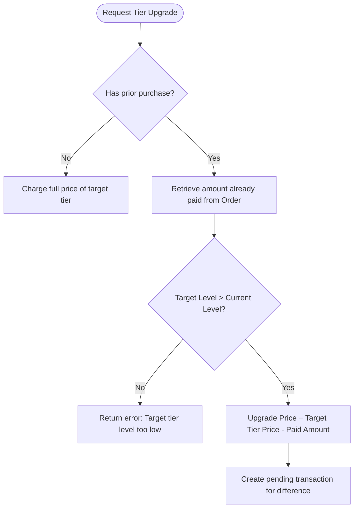

# ProjectNova - Architecture Documentation

This document explains the technical architecture of the ProjectNova platform, showing how data and authorization flow across the frontend application, the backend API, the database, and third-party gateways.

---

## 🗺️ High-Level System Architecture

ProjectNova is built on a decoupled, client-server model:
1.  **Frontend Client (Vite/React):** A single-page application (SPA) styled with TailwindCSS, managing client-side views, routes, state caches (Zustand), and payment gateway bindings.
2.  **Backend API (Node/Express):** A stateless RESTful service verifying client tokens, handling database queries, calculating upgrades, uploading media files, and listening to third-party webhooks.
3.  **Database (PostgreSQL):** Relational tables representing users, custom roles, projects, transactions, and system-wide setting overrides.



---

## 🔒 Authentication Flow (with MFA Toggles)

Authentication utilizes JSON Web Tokens (JWT) stored in HTTP-only cookies and Authorization Bearer headers. Users are forced through an MFA verify check if Multi-Factor Authentication is enabled in settings or configured on their profile.

### Login with MFA Verification Sequence:



---

## 💳 Checkout & Razorpay Payment Verification

ProjectNova guarantees payment integrity using signature verification. An order is initialized, a signature is verified, and a fallback webhook ensures consistency even if a customer closes their tab mid-transaction.

### E-Commerce Purchase Flow:



---

## 🔄 Dynamic Tier Upgrade Architecture

A signature feature of ProjectNova is the progressive upgrade calculation. When a user who owns an active project at a lower tier level decides to upgrade to a higher tier:
1.  **Backend Calculation:** The system retrieves the user's latest verified order for that project.
2.  **Price Difference Lookup:** It calculates `Upgrade Price = Target Tier Price - Amount Already Paid`.
3.  **Database Upgrade Hook:** Once paid, the upgrade confirmation code updates the user's original `Order` record to point to the new `tier_id` and adds an audit record in the database for tracking.



---

## 🛠️ Admin Functionality Flow

Administrators manage catalog metadata, permissions, and settings dynamically:
*   **Branding & Site Toggles:** When an administrator uploads a new logo, `multer` saves the file and the database `Settings` table updates. The client application fetches these config variables via a public context provider on startup.
*   **Role Management Engine:** Admins can create new roles. These custom roles and arrays of permissions are stored in a `"Role"` table. When a user performs actions, the backend checks the permissions array.

---

## ⚠️ Security & Error Handling Infrastructure

### Security Guardrails:
1.  **Rate Limiting:** Protects endpoints from brute-force login attacks.
2.  **Helmet Integration:** Disables diagnostic headers and sets Content Security Policies (CSP).
3.  **Strict Token Verification:** The authentication middleware extracts `userId` and `role` directly from the signed cryptographic payload, preventing clients from spoofing identity parameters in request payloads.
4.  **Raw Webhook Parsing:** The Razorpay webhook utilizes a special body-parsing sequence (`express.raw()`) to verify the signature of webhook payloads before JSON serialization.

### Unified Error Architecture:
All backend handlers catch failures inside try/catch blocks and return standardized JSON error messages:
```json
{
  "success": false,
  "error": "Error message description",
  "code": "ERROR_CODE_IDENTIFIER"
}
```
This enables the frontend client to intercept error codes (e.g. `TOKEN_EXPIRED`, `USER_MISMATCH`) and redirect users accordingly.
