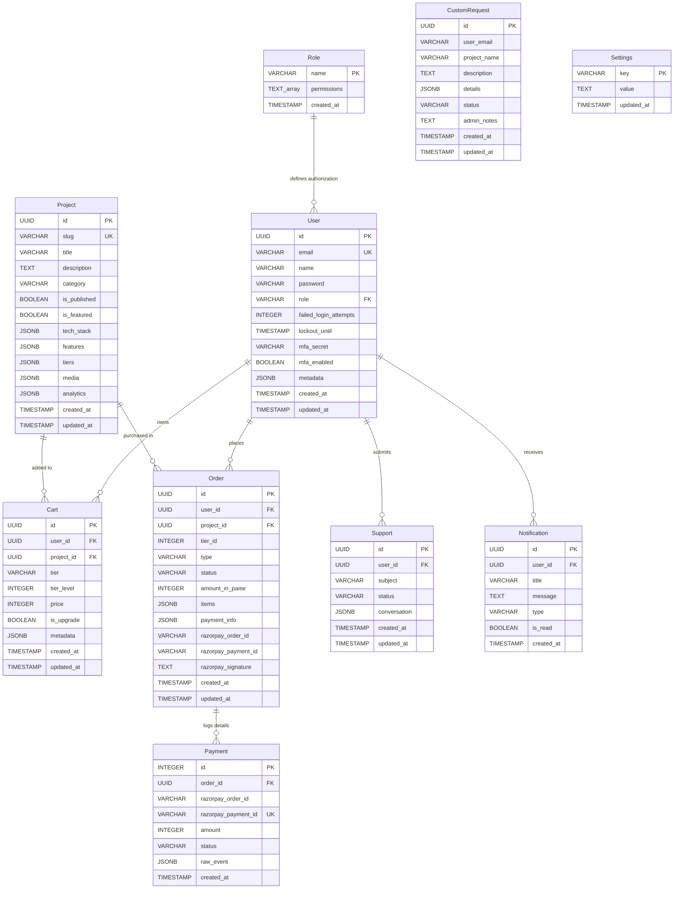

# ProjectNova - Database Schema Documentation

This document describes the PostgreSQL database schema for ProjectNova, including table properties, field constraints, relationship definitions, indexes, and an Entity-Relationship (ER) diagram.

---

## 📊 Entity Relationship Diagram

This diagram displays the tables generated by startup migrations and their primary/foreign key connections.



---

## 🗃️ Detailed Table Descriptions

### 1. `User`
Stores system accounts for standard customers and admins.
*   `id`: `UUID PRIMARY KEY DEFAULT gen_random_uuid()`
*   `email`: `VARCHAR(255) UNIQUE NOT NULL`
*   `name`: `VARCHAR(255) NOT NULL`
*   `password`: `VARCHAR(255) NOT NULL` (Bcrypt-hashed password)
*   `role`: `VARCHAR(50) DEFAULT 'user' REFERENCES "Role"(name)` (Foreign Key restricted)
*   `failed_login_attempts`: `INTEGER DEFAULT 0` (Throttles brute-force attempts)
*   `lockout_until`: `TIMESTAMP DEFAULT NULL` (Authentication lock expiry timestamp)
*   `mfa_secret`: `VARCHAR(255) DEFAULT NULL` (Secret TOTP key)
*   `mfa_enabled`: `BOOLEAN DEFAULT false` (User MFA enforcement check)
*   `metadata`: `JSONB DEFAULT '{}'` (Flexible field for avatar URLs, system parameters)
*   `created_at`: `TIMESTAMP DEFAULT CURRENT_TIMESTAMP`
*   `updated_at`: `TIMESTAMP DEFAULT CURRENT_TIMESTAMP`

### 2. `Project`
Stores details of standard projects uploaded to the catalog.
*   `id`: `UUID PRIMARY KEY DEFAULT gen_random_uuid()`
*   `slug`: `VARCHAR(255) UNIQUE NOT NULL` (SEO path identifier)
*   `title`: `VARCHAR(255) NOT NULL`
*   `description`: `TEXT NOT NULL`
*   `category`: `VARCHAR(100)`
*   `is_published`: `BOOLEAN DEFAULT true`
*   `is_featured`: `BOOLEAN DEFAULT false`
*   `tech_stack` / `technologies`: `JSONB DEFAULT '[]'` (e.g. `["React", "Node.js"]`)
*   `features`: `JSONB DEFAULT '[]'`
*   `tiers`: `JSONB DEFAULT '[]'` (Array containing levels, pricing, features, drive_link details)
*   `media`: `JSONB DEFAULT '{"images": [], "videos": []}'`
*   `analytics`: `JSONB DEFAULT '{"views": 0, "downloads": 0}'`

### 3. `Order`
Main order ledger representing payment transactions and tier ownership.
*   `id`: `UUID PRIMARY KEY DEFAULT gen_random_uuid()`
*   `user_id`: `UUID REFERENCES "User"(id) ON DELETE SET NULL`
*   `project_id`: `UUID REFERENCES "Project"(id) ON DELETE CASCADE`
*   `tier_id`: `INTEGER` (Level number, e.g. `1`, `2`, `3`)
*   `type`: `VARCHAR(50) NOT NULL` (`purchase` | `upgrade`)
*   `status`: `VARCHAR(50) DEFAULT 'pending'` (`pending` | `verified` | `paid` | `completed` | `failed` | `refunded`)
*   `amount_in_paise`: `INTEGER DEFAULT 0` (Razorpay total amount in cents)
*   `items`: `JSONB DEFAULT '[]'`
*   `payment_info`: `JSONB DEFAULT '{}'`
*   `razorpay_order_id`: `VARCHAR(255)`
*   `razorpay_payment_id`: `VARCHAR(255)`
*   `razorpay_signature`: `TEXT`

### 4. `Payment`
Webhook audit log tracking payment authorize, capture, and fail messages.
*   `id`: `SERIAL PRIMARY KEY`
*   `order_id`: `UUID REFERENCES "Order"(id) ON DELETE SET NULL`
*   `razorpay_order_id`: `VARCHAR(255)`
*   `razorpay_payment_id`: `VARCHAR(255) UNIQUE`
*   `amount`: `INTEGER DEFAULT 0`
*   `status`: `VARCHAR(50) DEFAULT 'pending'` (`pending` | `captured` | `failed`)
*   `raw_event`: `JSONB DEFAULT '{}'`

---

## ⚡ Key Indexes & Optimization Strategies

To ensure quick retrieval, indexes have been added to highly queried columns:
1.  `idx_user_email`: Added to `"User"(email)` for immediate login checks.
2.  `idx_project_slug`: Added to `"Project"(slug)` for fast catalog retrieval.
3.  `idx_project_featured_published`: Conditional index defined as:
    ```sql
    CREATE INDEX idx_project_featured_published 
    ON "Project" (is_featured DESC, created_at DESC) 
    WHERE is_published = true;
    ```
4.  `idx_order_razorpay_order_id`: Speed verification lookups during checkout confirms.
5.  `idx_payment_rzp_pid`: Unique index on Razorpay Payment ID to maintain absolute payment idempotency.
